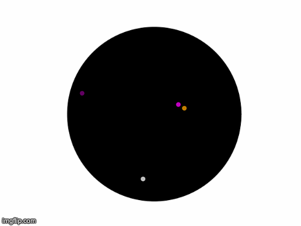

# Planetary Dataset
Anjali Kantharuban, Rushil Kapadia, Nikhil Mandava, Alok Elashoff, and Jinyoung Bae

## Description

This dataset can be used to generate positional information about the eight planets in the solar system given a time period and a location on earth. The positions are returned as would be measured by an observer at that place on earth - specifically, we provide the azimuth and altitude as welll as right ascension and declination (as an alternate measurement system). We also provide the distance of the planet, although this is not technically something an ancient astronomer would have been able to measure directly.

Beyond just offering data based off of a location on earth, we include a system of using premade or custom tools to appropriately distort the data to mimic the accuracy to which ancient astronomers would have been able to record planetry position. In `tools.json` you will find three provided tools.

Lastly, we provide the ability to generate images from the fuzzied measurements in the case that you would like to learn from image data. These images are helpful in that they remove the noise added by stars and other celestial objects while keeping the noise on the planets. This means they should be easier to learn off of than true raw images of the sky. For testing purposes, we offer a method of creating a clip that plays the generated images in order.
## Requirements

We provide a requirements.txt. You can ensure you have all the necessary requirements to run the project by running:
```
pip install -r requirements.txt
```


## Generating Data

This dataset contains a list of planetary data in the following format:
```
{
  'time': "YYYY-MM-DD",
  'image': "image_folder/YYYY-MM-DD.png",
  'planet_data': {
    'mercury': {
      'az': azimuth,
      'alt': altitude,
      'ra': right_ascension,
      'dec': declination,
      'dist': distance
    }
    ...
  }
}
```

There are seven available planets - Mercury, Venus, Mars, Jupiter, Saturn, Neptune, and Uranus. When generating this dataset with default arguments, only the first five are included because before the advent of modern instruments, Neptune and Uranus when not visible.

Images are not provided in the pre-generated dataset, but you can generate images of the night sky that represent how the planets would look when looking up at the sky from a particular location.

When generating the dataset with custom parameters there are a series of flags that can be used:
```
-h, --help            show this help message and exit
--T T                 The time from which you want to generate data in the
                        format YYYY-MM-DD_HH:MM
--dt DT               The timestep between data points in days.
--timesteps TIMESTEPS
                      The number of data points to generate.
--planets PLANETS [PLANETS ...]
                      Which planets out of (mercury, venus, mars, jupiter,
                      saturn, neptune, uranus) to include in the dataset.
--long LONG           The longitude of the location on earth the data is
                      observed from in degrees.
--lat LAT             The longitude of the location on earth the data is
                      observed from in degrees.
--tools TOOLS [TOOLS ...]
                      The list of tools used to calculate error. You can add
--tools_file TOOLS_FILE
                      The json files that contain data about each tool.
--alt_error ALT_ERROR
                      The maximum error in the measurement of altitude in
                      degrees.
--az_error AZ_ERROR   The maximum error in the measurement of azmith in
                      degrees.
--ra_error RA_ERROR   The maximum error in the measurement of right
                      ascension in hours.
--dec_error DEC_ERROR
                      The maximum error in the measurement of declination in
                      degrees.
--dist_error DIST_ERROR
                      The maximum error in the measurement of distance in
                      kilometers.
--data_file DATA_FILE
                      The data file to which the data json is stored.
--image               Generate images for each data point.
--image_folder IMAGE_FOLDER
                      The folder to which images are stored
```

Additionally, to create a movie from the images, use the command:
```
python3 generate_image image_file.py
```

## Examples
Here's some examples on how to generate various variations on our dataset.

If you want to generate data for just the planets closer to the Sun than earth with a sextant in Greece:
```
python3 generate_data.py --tools sextant --planets mercury venus --long 37.9838 --lat 23.7275
```

If you want to generate image data every day for 10,000 days starting in the year 0 and store it in a folder named "CS 189":
```
python3 generate_data.py --T 0000-01-01_00:00 --dt 1.0 --timesteps 100000 --image --image_folder "CS 189"
```

If you don't feel like creating a custom tool but you want to add a max of 0.1 degrees of error to each instrument:
```
python3 generate_data.py --alt_error 0.1 --az_error 0.1 --ra_error 0.1 --dec_error 0.1 --dist_error 0.1
```

## Generating movies
In order to generate a movie from a file of images, use this command with file_name as the name of the file, replacing 3 with the frames per second, and replacing 8000 with the number of frames to be used for the movie (it chooses the first 8000 in this case). Do not use the third tag if you want to convert all the images:
```
python3 make_movie.py --F file_name --FPS 3 --NUM 8000
```

Enjoy!



